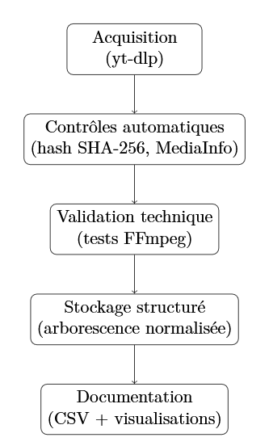

# web archives generator

Ce dépôt contient une expérimentation de collecte automatisée et de vérification de la qualité des archives numériques (ici des vidéos YouTube au format MP4), destinée à créer des sources exploitables scientifiquement et patrimonialement.

##  Contexte

Dans le cadre de l'archivage de la jouabilité, il faut aux archivistes et au historiens d'aujourd'hui des outils capables de capter les traces de ces expériences de jeux en ligne. Nombre des archives de la jouabilité se trouvent dans des vidéos aujourd'hui hebergées sur YouTube. Nous proposons donc un script capable de réaliser une collecte automatisée et contrôlé de vidéos depuis YouTube. Inspiré des pratiques d’automatisation et de contrôle qualité issues de l’industrie du jeu vidéo, ce projet applique une logique de **data continuous integration** à l’archivage numérique. L’objectif est de garantir la qualité des collectes au plus tôt dans le flux de production, une attention particulièrement cruciale lorsque la synchronisation entre image, son et métadonnées est un enjeu fondamental.

##  Fonctionnalités

- Acquisition automatisée de vidéos depuis YouTube (via `yt-dlp`)
- Contrôles d’intégrité (empreintes SHA-256), validation technique (`ffmpeg`)
- Structuration des fichiers collectés et des métadonnées (via `pandas`)
- Journalisation détaillée des opérations
- Génération de rapports exploitables (fichiers CSV)
- Chaîne complète, reproductible, documentée dans un notebook Jupyter



##  Outils utilisés

| Outil       | Fonction principale | Motivation du choix |
|-------------|---------------------|----------------------|
| `yt-dlp`    | Téléchargement des vidéos depuis YouTube | Robuste, fréquemment mis à jour, supporte de nombreuses plateformes |
| `SHA-256`   | Empreinte cryptographique pour l’intégrité des fichiers | Sensible à toute altération, garantit la traçabilité |
| `ffmpeg`    | Vérification technique et lisibilité des fichiers vidéo | Référence éprouvée pour le traitement multimédia |
| `pandas`    | Structuration, analyse, génération de rapports CSV | Puissant pour la gestion de données tabulaires en Python |

Ces outils forment un flux cohérent, qui garantit acquisition, vérification, documentation et traçabilité.

##  Accès au notebook

La chaîne complète est documentée et exécutable via un notebook Jupyter, accessible ici :  
[ExperienceArchivage.ipynb](https://github.com/sambec/web-archives-generator/blob/main/ExperienceArchivage.ipynb)

Ce notebook permet :
- d’exécuter pas à pas chaque étape du processus,
- d’analyser les résultats,  
- de comprendre les choix techniques (intégrité, alerte, journalisation).

##  Installation & Utilisation

Cloner le dépôt :
```bash
git clone https://github.com/sambec/web-archives-generator.git
```

Exécution :

 Lancez le notebook ExperienceArchivage.ipynb sur votre ordinateur directement ou vous pouvez l'ouvrir et l'excuter dans votre navigateur grâce à [Google Colab](https://colab.research.google.com/).

 ## Note

 Ce script a été réalisé dans le cadre de la rédaction de mon mémoire de fin d'étude, après un stage de 6 mois à Ubisoft en tant qu'ingénieure de données chargée d'automatiser le processus de vérification de la qualité des données de production. Ce script est compris parmis les livrables techniques présentés dans ce mémoire de M2 TNAH pour l'Ecole natiionale des Chartes.